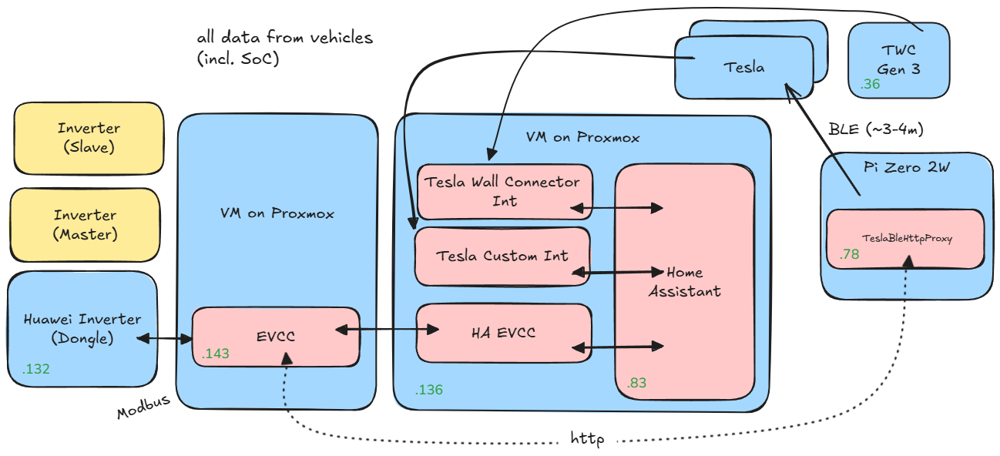

# EVCC
I have recently bought a solar system. And what could be better than have HA control the entire thing. We need ...
* [EVCC](https://evcc.io/) running in a separate VM
* [EVCC add-on](https://github.com/marq24/ha-evcc) to control charging of my Tesla
* ~~Huawei Solar Integration to have fancy dashboards~~
* [a TeslaBLEProxy to send commands to my Tesla](https://github.com/wimaha/TeslaBleHttpProxy)

You'll find the entire code in [evcc-sanitized.yaml](./evcc-sanitized.yaml). Note that this version is probably outdated as most of the config is changed in the UI itself.