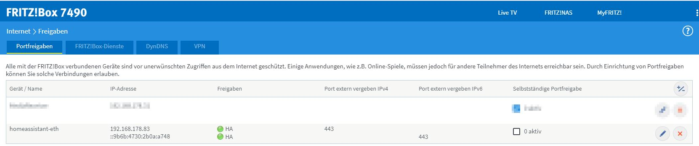

# How to access HA from the outside?


The fritzbox forwards port 443 to the Raspberry running HA.



## DuckDNS

* I want to access my HA instance remotely, so I needed a DNS name and Let's Encrypt support.

```
lets_encrypt:
  accept_terms: true
  certfile: fullchain.pem
  keyfile: privkey.pem
token: ##replaceme##
domains:
  - xxx.duckdns.org
aliases: []
seconds: 300
```

## NGINX Home Assistant SSL proxy

* forwards incoming SSL traffic from Fritzbox to HA's local port 8123.

```
domain: xxx.duckdns.org
certfile: fullchain.pem
keyfile: privkey.pem
hsts: max-age=31536000; includeSubDomains
cloudflare: false
customize:
  active: false
  default: nginx_proxy_default*.conf
  servers: nginx_proxy/*.conf

Network
Container	Host	Description
443/tcp      443
80/tcp		80
```

Also make sure to include `http.yaml` in `configuration.yaml` with

```
use_x_forwarded_for: true
trusted_proxies:
  - 172.30.33.0/24
  - 127.0.0.1
  - ::1
```

Using this setup, I can access HA locally with http://homeassistant-eth:8123/ and remotely with https://xxx.duckdns.org/.
This is particularly important as local devices may not be able to use HTTPS, so I can still use HTTP locally.

# AdGuard Home 

* filters out ads and other stuff (serves as DNS-server for the Fritzbox)

```
ssl: true
certfile: fullchain.pem
keyfile: privkey.pem
```

* Helpful document - albeit only in German - see https://techbox.rocks/optimierte-einstellungen-fuer-adguard-in-kombination-mit-einer-fritzbox-und-ipv6/
* Fritzbox configuration
  * Internet | Zugangsdaten | DNS Server
    * DNSv4-Server: "Andere DNSv4-Server verwenden" set both entries to 192.168.178.83 (internal IP address of Raspberry)
	* DNSv6-Server: "Andere DNSv6-Server verwenden" set both entries to fd00::e655:56be:4b9b:fb59 (internal IPv6 address of Raspberry)
  * Heimnetzwerk > Netzwerk > Netzwerkeinstellungen > weitere Einstellungen > IPv6-Konfiguration
    * check "Unique Local Addresses (ULA) immer zuweisen"
	* ULA-Präfix manuell festlegen to fd00
	* check "Diese FRITZ!Box stellt den Standard-Internetzugang zur Verfügung" to medium
	* check DNSv6-Server auch über Router Advertisement bekanntgeben (RFC 5006) and set "Lokaler DNSv6-Server:" to fd00:0:0:0:e228:6dff:fe11:406b (internal IPv6 address of Fritzbox)
	* DHCPv6-Server im Heimnetz: DHCPv6-Server in der FRITZ!Box für das Heimnetz aktivieren: check "Nur DNS-Server zuweisen"
# MariaDB
* Moved from Sqlite to using this https://community.home-assistant.io/t/migrating-home-assistant-database-from-sqlite-to-mariadb/96895/23

# SSH & Web Terminal
* not to be confused with "Terminal & SSH"
* this is as special version which gives me elevated access to the Raspberry

```
ssh:
  username: hassio
  password: ''
  authorized_keys: ##replaceme##
  sftp: false
  compatibility_mode: false
  allow_agent_forwarding: false
  allow_remote_port_forwarding: false
  allow_tcp_forwarding: false
zsh: true
share_sessions: false
packages: []
init_commands: []
```

# Backup to Google Drive
* installed "Home Assistant Google Drive Backup" from Supervisors' add-ons
* working with the stock install, just disabled mariadb

# deCONZ

* to run my ZigBee devices

# HACS: Alexa Media Player

* see https://github.com/custom-components/alexa_media_player/wiki
* no "Cookie import" or "Configuration.yaml" required 
* do not forget to enter the OTP code at the end (https://www.amazon.com/a/settings/approval/addbackup)
* https://community.home-assistant.io/t/alexa-tts-announcement-from-lovelace-ui-and-without-nabu-casa-alexa-media-player/259980/7

# Deprecated stuff

## HACS: iCloud3 Device Tracker (deprecated, no longer in use)

* iCloud has authentication problems, so I was looking for an alternative
* see https://gcobb321.github.io/icloud3/#/
* config see https://github.com/swa72/home-assistant/blob/main/config_ic3.yaml

## Glances (deprecated, no longer in use)

* to monitor the Raspberry

```
log_level: info
process_info: false
refresh_time: 10
ssl: false
certfile: fullchain.pem
keyfile: privkey.pem
influxdb:
  enabled: false
  host: ##replaceme##
  port: 8086
  username: glances
  password: '!secret glances_influxdb_password'
  database: glances
  prefix: localhost
  interval: 60
```

## Backup to Samba Drive (deprecated, no longer in use)

* to have regular config backups to the USB stick of the Fritzbox
* note that username ##replaceme## must be available on the Fritzbox ("System > FRITZ!Box-Benutzer > Benutzer") and that particular user requires access to the attached USB stick

```
host: 192.168.178.1
share: FRITZ.NAS
target_dir: CCCOMA_X64F\ha
username: ##replaceme##
password: ##replaceme##
keep_local: 14
keep_remote: all
trigger_time: '00:00'
trigger_days:
  - Mon
  - Tue
  - Wed
  - Thu
  - Fri
  - Sat
  - Sun
exclude_addons: []
exclude_folders: []
backup_name: '{type} Snapshot {version} {date}'
```