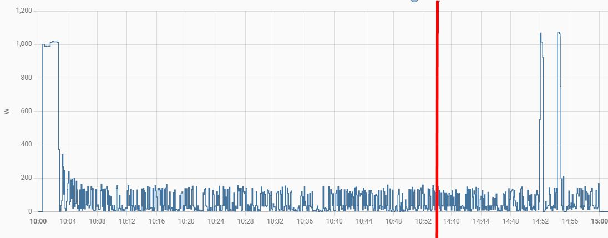

# Count number of espresso cups using power consumption

My Rancilio Silvia has a typical power consumption pattern that looks like this



For a number of minutes the boiler heats up with close to 1.000 Watts, then the machine idles the entire day using between 3 and 180 Watts. Pulling a shot brings the power consumption up, albeit for a short time.

You need ...
* a power measurement device, such as a Shelly Plug S or similar.
* a helper `counter.silvia` for obvious reasons (add with Settings | Devices & Services | Helpers)
* a helper `input_boolean.silvia_running` which tells us when we can use the counter (add with Settings | Devices & Services | Helpers)

There are two automations that take care of the rest. One automation which increases the counter by one and another one  which sets the helper `input_boolean.silvia_running`. The helper is true if one of the conditions is met...
  * 5min after turning on the machine
  * HA started and power consumption is greater than zero (and less than 200W)
  * Automations got reloaded and power consumption is greater than zero (and less than 200W)
  
And here are the two automations

## Silvia counter

```yaml
alias: Silvia counter
description: ""
trigger:
  - platform: numeric_state
    entity_id: sensor.shellys_silvia_power
    for:
      hours: 0
      minutes: 0
      seconds: 12
    above: "400"
condition: []
action:
  - if:
      - condition: state
        entity_id: input_boolean.silvia_running
        state: "on"
    then:
      - service: counter.increment
        data: {}
        target:
          entity_id: counter.silvia
    else:
      - service: notify.mobile_app_iphone
        data:
          title: Hinweis
          message: Counter Silvia not increased
mode: single
```

## Silvia Running Or Not
  
```yaml
alias: Silvia Running Or Not
description: ""
trigger:
  - platform: numeric_state
    entity_id: sensor.shellys_silvia_power
    for:
      hours: 0
      minutes: 5
      seconds: 0
    above: 0
    id: silvia_on_for_min
  - platform: state
    entity_id:
      - sensor.shellys_silvia_power
    to: "0.0"
    id: silvia_turned_off
  - platform: homeassistant
    event: start
    id: ha_started
  - platform: event
    event_type: call_service
    event_data:
      domain: automation
      service: reload
    id: automation_reload
condition: []
action:
  - choose:
      - conditions:
          - condition: trigger
            id: silvia_on_for_min
        sequence:
          - service: input_boolean.turn_on
            data: {}
            target:
              entity_id: input_boolean.silvia_running
      - conditions:
          - condition: trigger
            id: ha_started
        sequence:
          - if:
              - condition: numeric_state
                entity_id: sensor.shellys_silvia_power
                above: 0
              - condition: numeric_state
                entity_id: sensor.shellys_silvia_power
                below: 200
            then:
              - service: input_boolean.turn_on
                data: {}
                target:
                  entity_id: input_boolean.silvia_running
            else:
              - service: input_boolean.turn_off
                data: {}
                target:
                  entity_id: input_boolean.silvia_running
      - conditions:
          - condition: trigger
            id: automation_reload
        sequence:
          - if:
              - condition: numeric_state
                entity_id: sensor.shellys_silvia_power
                above: 0
              - condition: numeric_state
                entity_id: sensor.shellys_silvia_power
                below: 200
            then:
              - service: input_boolean.turn_on
                data: {}
                target:
                  entity_id: input_boolean.silvia_running
            else:
              - service: input_boolean.turn_off
                data: {}
                target:
                  entity_id: input_boolean.silvia_running
      - conditions:
          - condition: trigger
            id: silvia_turned_off
        sequence:
          - service: input_boolean.turn_off
            data: {}
            target:
              entity_id: input_boolean.silvia_running
mode: single

```


