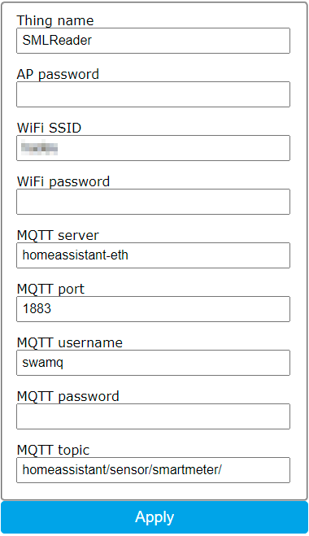
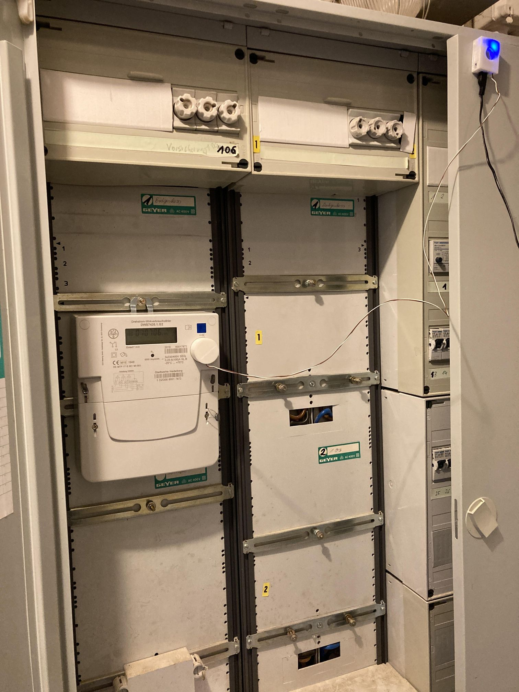

# How to read the power meter
My power meter is a DZG, DWS7420.1.GZ. I ordered a reader (bre-built ESP device) off of ebay.
The device is based on https://github.com/mruettgers/SMLReader. Installation of the reader was 
pretty much straightforward. I had to configure my personal WiFi and assign a fixed IP address 
in my Fritzbox.



How to fill the data? I didn't change `Thing name` but set an AP password, otherwise the device wouldn't work.
MQTT username and password were configured in "Configuration | Users" in HA, `homeassistant-eth` is the local name of my raspi.
MQTT port was set in "Supervisor | Mosquitto broker | Configuration". You can pick an arbitrary topic name.

The head attaches to the SML interface of the meter and is kept in place with a magnet. Once connected to power, the
blue LED flashes and sends data. 



You can check whether Mosquitto receives topics in "Configuration | Integrations | Mosquitto broker | Configure" and start 
listening to the topic `homeassistant/sensor/smartmeter/#`. Note the hash at the end.

Without entering a PIN for the power meter (You need to ask your energy provider), I only receive three data points
* manufacturer of the power meter
* device ID
* total energy consumed (kWh)

Adding the PIN and turning the `info` parameter on the meter to `on`, also gives
* current power (W)

Entering the PIN is described in [a manual that I googled](https://evf.de/dateien/downloads/bedienungsanleitung-dzg-dvs7420.pdf).

## Configuration in HA

Now that HA receives MQTT topics, we define some sensors to record the data. I have added 
```
- platform: mqtt
  name: "SMLReaderManufacturer"
  state_topic: "homeassistant/sensor/smartmeter/sensor/1/obis/1-0:96.50.1/1/value"
- platform: mqtt
  name: "SMLReaderDeviceID"
  state_topic: "homeassistant/sensor/smartmeter/sensor/1/obis/1-0:96.1.0/255/value"
- platform: mqtt
  name: "SMLReaderCounter"
  state_topic: "homeassistant/sensor/smartmeter/sensor/1/obis/1-0:1.8.0/255/value"
  unit_of_measurement: "kWh"
  device_class: energy
- platform: mqtt
  name: "SMLReaderPower"
  state_topic: "homeassistant/sensor/smartmeter/sensor/1/obis/1-0:16.7.0/255/value"
  unit_of_measurement: "W"
  device_class: power
```
to my `sensors.yaml` file. For further processing in HA, I also define another template sensor.
```
- platform: template
  sensors:
    smlreadertotalenergyconsumption:
      unit_of_measurement: "kWh"
      value_template: >
        
          {{ states('sensor.smlreadertotaltnergyconsumption') }}
        
          {{ ((states('sensor.smlreadercounter') | float) * 0.001) }}
        
```
Usually the template sensor's value would turn to 0 if the ESP device is unavailable. This results in problems 
when using the sensor in combination with the Utility Meter integration. The state template (#fixme#) provided above checks 
for the sensor's availability and keeps the current state in case of unavailability.

Note that `sensor.smlreadertotaltnergyconsumption` is used for further processing 
in three places
* HA's energy dashboard
* Utility meter integration
* Grafana/Influxdb

## Energy dashboard
For HA's energy dashboard to work I had to add
```
sensor.smlreadertotalenergyconsumption:
  device_class: energy
  state_class: total_increasing
```
to my `customize.yaml` file. Finally, I just used "Configuration | Energy | Electricity grid" to add the sensor, waited for a couple of hours and it showed up.
## Utility meter integration
I have simply added 
```
utility_meter:
  smlpower_hourly:
    source: sensor.smlreadertotalenergyconsumption
    cycle: hourly
  smlpower_daily:
    source: sensor.smlreadertotalenergyconsumption
    cycle: daily
  smlpower_weekly:
    source: sensor.smlreadertotalenergyconsumption
    cycle: weekly
  smlpower_monthly:
    source: sensor.smlreadertotalenergyconsumption
    cycle: monthly
  smlpower_yearly:
    source: sensor.smlreadertotalenergyconsumption
    cycle: yearly
```
to my `configuration.yaml` file.
## Grafana/Influxdb
I have included two lines in my influxdb configuration
```
  include:
    entities:
      - sensor.smlreadertotalenergyconsumption
    entity_globs:
      - sensor.smlpower*
```
in my `configuration.yaml` file. A simple daily power usage visualisation of the last seven days in Grafana could be 
```
SELECT spread("value") FROM "kWh" WHERE ("entity_id" = 'smlreadertotalenergyconsumption') AND time >= now() - 7d and time <= now() GROUP BY time(1d) fill(previous)
```
Note the use of the `spread` operator.

You'll find the entire code in [configuration.yaml](./configuration.yaml), [customize.yaml](./customize.yaml) and [sensors.yaml](./sensors.yaml).