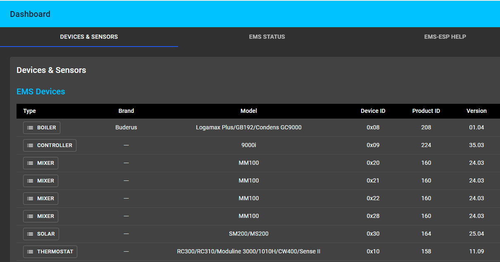

# home-assistant

My first attempt at running a home automation system was a Shelly device integrated to HomeKit - worked nicely. Then I fiddled around with running https://homebridge.io/ on my Raspberry 4, moved over to https://hoobs.org/ and realized that there must be something better. Luckily I found Home Assistant.

## My goal

Have a nice and easy interface for the house on the iPad (no need for my wife and kids to access any of the Home Assistant stuff). Have an advanced interface to the house for myself.

This file is intended for me to document the quirks I had during setup and for others to learn and avoid them.

## My setup

* Router Fritz!Box 7490 with open external ports 443 and 8123 to the Raspberry 4 (no DynDNS on fritz.box)
  * my doorbell is directly hooked up to the Fritzbox
  * Fritzbox has an attached USB stick
* Raspberry 4 running Home Assistant 2021.1.5
  * initially connected thru wifi, later moved to ethernet and directly connected to the Fritzbox
  * conbee USB stick to manage ZigBee network
* a Buderus Logamax Plus GB192i heating (described below)
* Regular backup to a samba share (described below)
* Regular updates to git (described below)
* Editing files with Notepad++
  * Change tab with to 2 using ```Settings > Preferences > Language > Tab Settings```
* I run a bunch of add-ons, described in the following sections.

## AdGuard Home 

* filters out ads and other stuff (serves as DNS-server for the Fritzbox)

```
ssl: true
certfile: fullchain.pem
keyfile: privkey.pem
```

* Helpful document - albeit only in German - see https://techbox.rocks/optimierte-einstellungen-fuer-adguard-in-kombination-mit-einer-fritzbox-und-ipv6/
* Fritzbox configuration
  * Internet | Zugangsdaten | DNS Server
    * DNSv4-Server: "Andere DNSv4-Server verwenden" set both entries to 192.168.178.83 (internal IP address of Raspberry)
	* DNSv6-Server: "Andere DNSv6-Server verwenden" set both entries to fd00::e655:56be:4b9b:fb59 (internal IPv6 address of Raspberry)
  * Heimnetzwerk > Netzwerk > Netzwerkeinstellungen > weitere Einstellungen > IPv6-Konfiguration
    * check "Unique Local Addresses (ULA) immer zuweisen"
	* ULA-Präfix manuell festlegen to fd00
	* check "Diese FRITZ!Box stellt den Standard-Internetzugang zur Verfügung" to medium
	* check DNSv6-Server auch über Router Advertisement bekanntgeben (RFC 5006) and set "Lokaler DNSv6-Server:" to fd00:0:0:0:e228:6dff:fe11:406b (internal IPv6 address of Fritzbox)
	* DHCPv6-Server im Heimnetz: DHCPv6-Server in der FRITZ!Box für das Heimnetz aktivieren: check "Nur DNS-Server zuweisen"

## DSS VoIP Notifier

* using my Fritzbox as a SIP server (HA can initiate calls and play audio stuff using tts)
* install https://github.com/sdesalve/hassio-addons/tree/master/dss_voip as a simple add-on (Supervisor | Add-on Store | ... (top right) | Repositories | add https://github.com/sdesalve/hassio-addons)
* enable tts like https://www.home-assistant.io/integrations/google_translate
```
tts:
  - platform: google_translate
    language: 'de'
    service_name: google_translate_say
    base_url: https://xxx.duckdns.org
```
* configuration (note that ```192.168.178.1``` is the IP address of my Fritzbox, and ```192.168.178.83``` is the IP address of my raspberry
```
sip_parameters:
  caller_id_uri: 'sip:homeassistant@192.168.178.1:5060'
  realm: '*'
  username: homeassistant
  password: '<replace-me-with-digits-only>'
pjsua_custom_options: '--ip-addr=192.168.178.83'
```
* steps to do on Fritzbox:, see https://superuser.com/questions/829824/android-wont-register-sip-on-Fritzbox-router
  * log on to your Fritzbox
  * select Telefoniegeräte (phone | devices)
  * Add Phone
  * LAN/WLAN (IP Phone), named 'homeassistant'
  * enter username homeassistant, passwort ONLY digits
  * pick a number (any number will do)
  * don't accept any outside calls (not required in my case)
  * my Fritzbox registered a new device with internal number *622
* start the "DSS VoIP Notifier" add-on and check the logs
* now try calling the service like (e.g. from the "Developer Tools" section in HA)

```
- service: hassio.addon_stdin
  data_template:
	addon: 89275b70_dss_voip
	input: {"call_sip_uri":"sip:**614@192.168.178.1","message_tts":"Hallo Stefan"}
```
* in the above case **614 is my internal office number
* for playing audio files (or DTMF tones), use something like
```
{"call_sip_uri":"sip:**1@192.168.178.1","audio_file_url":"https://xxx.duckdns.org/local/open_door_short.mp3", "call_duration":"6"}
```
and store mp3 files in folder ```\config\www```. Note that the call is automagically ended after six seconds.

## DuckDNS

* I want to access my HA instance remotely, so I needed a DNS name and Let's Encrypt support.

```
lets_encrypt:
  accept_terms: true
  certfile: fullchain.pem
  keyfile: privkey.pem
token: ##replaceme##
domains:
  - xxx.duckdns.org
aliases: []
seconds: 300
```

## File editor

* to remotely edit files

## Glances 

* to monitor the Raspberry

```
log_level: info
process_info: false
refresh_time: 10
ssl: false
certfile: fullchain.pem
keyfile: privkey.pem
influxdb:
  enabled: false
  host: ##replaceme##
  port: 8086
  username: glances
  password: '!secret glances_influxdb_password'
  database: glances
  prefix: localhost
  interval: 60
```

## Log Viewer

* to check log files (what else?)


## MariaDB

* Moved from Sqlite to using this https://community.home-assistant.io/t/migrating-home-assistant-database-from-sqlite-to-mariadb/96895/23

## NGINX Home Assistant SSL proxy

* forwards incoming SSL traffic from Fritzbox to HA
```
domain: xxx.duckdns.org
certfile: fullchain.pem
keyfile: privkey.pem
hsts: max-age=31536000; includeSubDomains
cloudflare: false
customize:
  active: false
  default: nginx_proxy_default*.conf
  servers: nginx_proxy/*.conf
```

## SSH & Web Terminal

* not to be confused with "Terminal & SSH"
* this is as special version which gives me elevated access to the Raspberry

```
ssh:
  username: hassio
  password: ''
  authorized_keys: ##replaceme##
  sftp: false
  compatibility_mode: false
  allow_agent_forwarding: false
  allow_remote_port_forwarding: false
  allow_tcp_forwarding: false
zsh: true
share_sessions: false
packages: []
init_commands: []
```

## Samba Backup 

* to have regular config backups to the USB stick of the Fritzbox
* note that username ##replaceme## must be available on the Fritzbox ("System > FRITZ!Box-Benutzer > Benutzer") and that particular user requires access to the attached USB stick

```
host: 192.168.178.1
share: FRITZ.NAS
target_dir: CCCOMA_X64F\ha
username: ##replaceme##
password: ##replaceme##
keep_local: 14
keep_remote: all
trigger_time: '00:00'
trigger_days:
  - Mon
  - Tue
  - Wed
  - Thu
  - Fri
  - Sat
  - Sun
exclude_addons: []
exclude_folders: []
backup_name: '{type} Snapshot {version} {date}'
```

## Samba share

* to be able to access and edit files on the Raspberry from a Windows machine

```
workgroup: WORKGROUP
username: ##replaceme##
password: ##replaceme##
interface: ''
allow_hosts:
  - 10.0.0.0/8
  - 172.16.0.0/12
  - 192.168.0.0/16
  - 'fe80::/10'
veto_files:
  - ._*
  - .DS_Store
  - Thumbs.db
  - icon?
  - .Trashes
compatibility_mode: false
```

## deCONZ

* to run my ZigBee devices


## motionEye

* an old iPhone serving as a guinea pig camera
* for motionEye's webhooks I had to install NGINX as add-on (see https://community.home-assistant.io/t/motioneye-integration/194350/42)
* triggers action if motion is detected 

# Useful stuff

## Template

* Prints out all entities
```

{{ state.entity_id }}

```
or
```

{{ state.entity_id }}, {{ states(state.entity_id) }}

```

## HACS: iCloud3 Device Tracker

* iCloud has authentication problems, so I was looking for an alternative
* see https://gcobb321.github.io/icloud3/#/
* config see https://github.com/swa72/home-assistant/blob/main/config_ic3.yaml

## HACS: Alexa Media Player

* see https://github.com/custom-components/alexa_media_player/wiki
* no "Cookie import" or "Configuration.yaml" required 
* https://community.home-assistant.io/t/alexa-tts-announcement-from-lovelace-ui-and-without-nabu-casa-alexa-media-player/259980/7

## Push automation to github
 
* an automation to regularly update my config to github (see https://github.com/swa72/home-assistant/blob/main/automations.yaml), credit: https://peyanski.com/automatic-home-assistant-backup-to-github/

```
- id: l1k3
  alias: push HA configuration to GitHub repo
  trigger:
  - at: '23:23:00'
    platform: time
  action:
  - data:
      addon: a0d7b954_ssh
      input: /config/gitpush.sh
    service: hassio.addon_stdin
```

## Fritzbox call monitor
* see https://www.home-assistant.io/integrations/fritzbox_callmonitor/
* using user swa on Fritzbox
* you may need to enable the call monitor after a restart of the Fritzbox using "To activate the call monitor on your FRITZ!Box, dial #96*5* from any phone connected to it."

## Heating 
* I have a Buderus Logamax Plus GB192i heating, a central control unit RC300 and had problems with 
overshooting temperatures in my house, particularly during sunny winter days. Additionally, I wanted
to integrate the heating to HA. I have three circuits
  * ground floor and first floor radiators
  * underfloor heating for certain rooms in the ground floor
  * second floor radiators
* and solar-supported warm water.
* I thought about going the 
tado route but stumbled across https://bbqkees-electronics.nl/, which basically provides a plug-in or gateway to my
heating. The gateway ...
  * plugs into the heating via its service jack
  * complements the existing EMS bus (i.a. think of it as a separate control unit)
* I plugged the gateway into my heating with the existing cable and somehow got a loose contact; replaced the cable with the one supplied from bbqkees and everything runs fine.
* before and after


* Having connected the gateway with the heating, the gateway powers up and provides a WLAN. You can connect to the WLAN and configure the device to 
connect to your local WLAN (don't forget to give it a static address).
* The gateway finds all connected devices on the EMS bus:


* I enabled NTP on the gateway
* I then followed the instructions on https://bbqkees-electronics.nl/wiki/gateway/home-assistant-configuration.html to integrate it into HA
* installed Mosquitto broker
  * via Supervisor | Add-on store
  * started the add-on
  * added a user ```swamq```
* enabled MQTT in the web interface of the gateway
  * Host: ```homeassistant-eth```, which is the local address of the raspberry (i.e. ```192.168.178.83```)
  * Username: see above
  * Format: ```Home Assistant```
* Apparently that was it, as MQTT immediately picked up all five devices
* Went to Configuration | Integration | MQTT and clicked on devices. For each of the five devices, click on 
  the device name and use "Add to lovelace" to add all entities.
* Only caveat: given that my RC300 thermostat controls three circuits, I had to add the following sensors manually to lovelace.
For some reason or the other, only the third got added automagically.
```
  - sensor.thermostat_hc1_comfort_temperature
  - sensor.thermostat_hc1_control_mode
  - sensor.thermostat_hc1_design_temperature
  - sensor.thermostat_hc1_eco_temperature
  - sensor.thermostat_hc1_manual_temperature
  - sensor.thermostat_hc1_max_flow_temperature
  - sensor.thermostat_hc1_min_flow_temperature
  - sensor.thermostat_hc1_mode
  - sensor.thermostat_hc1_mode_type
  - sensor.thermostat_hc1_nofrost_temperature
  - sensor.thermostat_hc1_offset_temperature
  - sensor.thermostat_hc1_room_influence
  - sensor.thermostat_hc1_setpoint_room_temperature
  - sensor.thermostat_hc1_summer_temperature
  - sensor.thermostat_hc1_target_flow_temperature
  - sensor.thermostat_hc1_timer_program
  - sensor.thermostat_hc1_hatemp
  - sensor.thermostat_hc2_comfort_temperature
  - sensor.thermostat_hc2_control_mode
  - sensor.thermostat_hc2_design_temperature
  - sensor.thermostat_hc2_eco_temperature
  - sensor.thermostat_hc2_manual_temperature
  - sensor.thermostat_hc2_max_flow_temperature
  - sensor.thermostat_hc2_min_flow_temperature
  - sensor.thermostat_hc2_mode
  - sensor.thermostat_hc2_mode_type
  - sensor.thermostat_hc2_nofrost_temperature
  - sensor.thermostat_hc2_offset_temperature
  - sensor.thermostat_hc2_room_influence
  - sensor.thermostat_hc2_setpoint_room_temperature
  - sensor.thermostat_hc2_summer_temperature
  - sensor.thermostat_hc2_target_flow_temperature
  - sensor.thermostat_hc2_timer_program
  - sensor.thermostat_hc2_hatemp
  ```
  