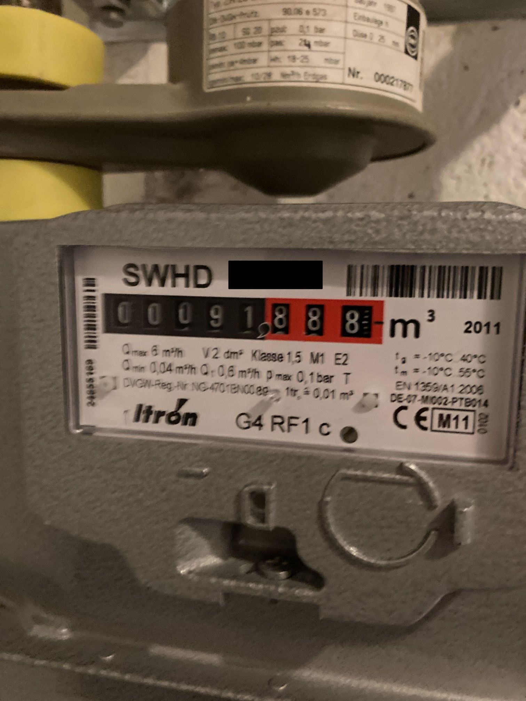
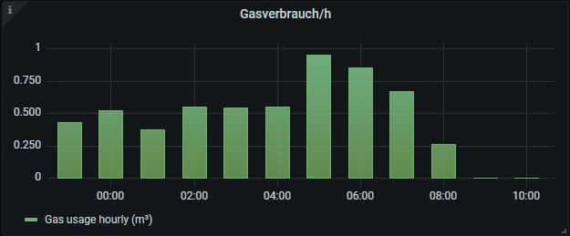

# Reading a G4 RF1 c gas meter with Itron's Cyble Sensor

I have a pretty standard gas meter as shown on the picture below. 



My provider was so nice to provide me with a sensor for free. 
It's a [Cyble sensor](https://www.itron.com/-/media/feature/products/documents/brochure/cyble_sensor_brochure_gas_meter_en.pdf).
You can buy it for around 60EUR.
The sensor has two wires ("No polarity to be observed. The signal is equivalent to a dry contact signal (e.g. reed switch)."). Pulse 
duration is 35ms to 65ms, so pretty quick. 

Question remains: how do I get the data into Home Assistant? ESPHome is the answer, even for a non-hardware guy like me.
It also helps if other people ([@saruter](https://smarthome.ms1.de/projekte/gasverbrauch/)) have done it before with other sensors.

There is one caveat though: all of these must be running or the counter impulses are not recorded
* the Wifi (i.e. the router) connecting the ESP with HA
* the ESP
* the sensor
* the raspberry running HA (no reboot or you will miss counts)
  * I stop the heating, reboot/update HA, then turn the heating back on to not miss any counts

I have it running for some time now and the deviation between what I record in HA and the actual gas meter is less than one percent.

## Hardware parts
* an ESP32 (I picked a development version with a micro-USB port), ca. 7EUR
* a USB to micro-USB cable, ca. 0EUR
* an old micro-USB power supply with 5V, ca. 0EUR
* a generic breadboard, ca. 5EUR
* some wires

## Step 1: flash the ESP initially
* put the ESP32 on the breadboard
* install ESPHome add-on (see [getting started guide](https://esphome.io/guides/getting_started_hassio.html))
* connect the ESP32 with the USB cable to the raspberry PI (any USB port will do)
* start ESPHome add-on
  * in the ESPHome user interface on the top right, you'll find a new USB connection. If not, restart ESPHome
* create a new configuration (big "+" bottom right) that fits your ESP, name it, say `gas3`, and flash in onto the ESP
* check if Home Assistant reports a new device

## Step 2: count the impulses
* you now have a new directory `config\esphome\` with a new yaml file `gas3.yaml` that contains the configuration of the ESP
* copy all relevant parts from my [`gas3.yaml`](./gas3.yaml) to this file
  * you may need to edit the wifi stuff (which I put into my `secrets.yaml` file) or the name of the new counter
	* if you use a `config\secrets.yaml` file, you need another one in `config\esphome` that just contains
	`<<: !include ../secrets.yaml`
* flash the modified file to the ESP, using "Upload"
* check if Home Assistant reports a new entity for your ESP
* disconnect the ESP from the USB
* you can do all  future updates over-the-air

## Step 3: hook up the device to the meter
* connect GPIO21 pin with one cable of the Cyble sensor
* connect GND  pin with the other cable of the Cyble sensor
* connect the Cyble sensor to gas meter
* connect the micro-USB power supply to the ESP
* wait for HA to show data. 

## Step 4: visualize the data
I have used an entities card to visualize the data (`sensor.gasverbrauch`) in lovelace (for the others, see the next section).
```
type: entities
entities:
  - entity: sensor.gasverbrauch
  - entity: sensor.gasverbrauch_zaehler
    icon: 'mdi:counter'
  - entity: sensor.gasverbrauch_hourly
  - entity: sensor.gasverbrauch_daily
title: Gasverbrauch
```

I have added the following to my `configuration.yaml` of Home Assistant, to get aggregated data using the [Utility meter integration](https://www.home-assistant.io/integrations/utility_meter/).

```
utility_meter:
  gasverbrauch_hourly:
    source: sensor.gasverbrauch
    cycle: hourly
  gasverbrauch_daily:
    source: sensor.gasverbrauch
    cycle: daily
  gasverbrauch_weekly:  
    source: sensor.gasverbrauch
    cycle: weekly
  gasverbrauch_monthly:
    source: sensor.gasverbrauch
    cycle: monthly
  gasverbrauch_yearly:
    source: sensor.gasverbrauch
    cycle: yearly
```

As `sensor.gasverbrauch` starts with zero and my gas meter reads a different value, I've created a new 
sensor in `sensors.yaml` to account for that.

```
- platform: template
  sensors:
    gasverbrauch_zaehler:
      friendly_name: "Gaszähler"
      value_template: "{{ states('sensor.gasverbrauch')| float + 126.479 }}"
```

Eventually all data gets visualized in grafana. I use 

```
SELECT spread("value") FROM "m³" WHERE ("entity_id" = 'gasverbrauch_hourly') AND $timeFilter GROUP BY time(1h) fill(none)
```
to display




All files are available on my [github repo](https://github.com/swa72/home-assistant).
